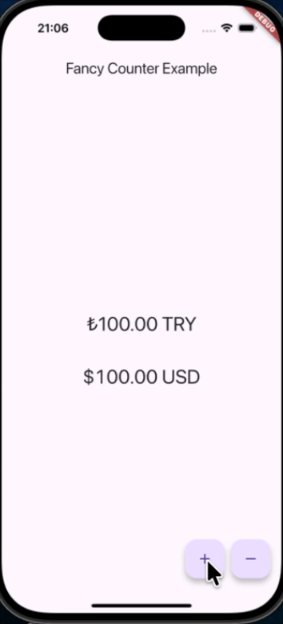

# fancy_counter

A Flutter package providing two highly customizable, animated number counters: `AnimatedTextCounter` and `FlipCounter`.

Showcase your statistics, scores, or any dynamic number with smooth, beautiful animations and optional color flashes.

---



---

## Features

* **Two Widgets in One:**
  * **`AnimatedTextCounter`**: Animates a text value smoothly from an old number to a new one.
  * **`FlipCounter`**: Animates each digit individually with a "scroll" or "odometer" effect.
* **Highly Customizable:** Control the `duration`, `curve` (including elastic and bounce effects), `prefix`, `postfix`, and `fractionDigits`.
* **Color Flash:** Automatically flashes a custom color on value `increase` or `decrease` (e.g., green for up, red for down). This feature is optional.
* **Performant:** Both widgets are state-managed and optimized for performance, rebuilding only what's necessary.
* **Well-Documented:** All public-facing properties are fully documented.

## Getting Started

1. Add the package to your `pubspec.yaml` file:

```yaml
dependencies:
  fancy_counter: ^0.0.1 # Check pub.dev for the latest version
````

2. Install the package:

```bash
flutter pub get
```

3. Import the package in your Dart file:

```dart
import 'package.fancy_counter/fancy_counter.dart';
```

## Usage

Using the widgets is simple. Just provide a `value` and a `duration`.

### `AnimatedTextCounter`

This widget is great for general-purpose counters where the whole number animates smoothly.

```dart
AnimatedTextCounter(
  value: _yourCounterValue,
  duration: const Duration(milliseconds: 500),
  style: Theme.of(context).textTheme.headlineMedium,
  prefix: "₺",
  fractionDigits: 2,
  // Add color flashes!
  increaseColor: Colors.green,
  decreaseColor: Colors.red,
)
```

### `FlipCounter`

This widget gives a mechanical "odometer" or "flip" feel, as each digit scrolls individually.

```dart
FlipCounter(
  value: _yourCounterValue,
  duration: const Duration(milliseconds: 500),
  style: Theme.of(context).textTheme.headlineMedium,
  prefix: "€",
  fractionDigits: 2,
  // Supports all the same features!
  increaseColor: Colors.blue,
  decreaseColor: Colors.orange,
  curve: Curves.elasticOut, // Try a fun curve!
)
```

## Main Properties

| Property | Type | Description |
| :--- | :--- | :--- |
| `value` | `double` | **Required.** The target value to animate to. |
| `duration` | `Duration` | **Required.** The duration of the animation. |
| `style` | `TextStyle?` | The style of the text. |
| `curve` | `Curve` | The animation curve (e.g., `Curves.easeOut`, `Curves.elasticOut`). |
| `prefix` / `postfix` | `String` | Text to display before or after the number. |
| `fractionDigits` | `int` | The number of decimal places to show. |
| `increaseColor` | `Color?` | The color to flash when the value increases. |
| `decreaseColor` | `Color?` | The color to flash when the value decreases. |
| `animateOnFirstBuild` | `bool` | Whether to animate from 0 on the first build. |

## Additional Information

### Issues & Contributions

Found a bug or have a feature request? Please file an issue on the GitHub repository:

`https://github.com/bedii97/fancy_counter/issues`

Contributions are also welcome\!
